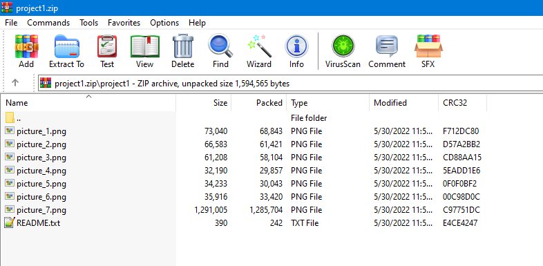
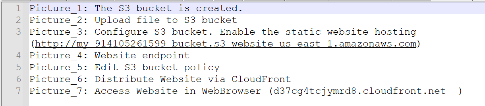

# PROJECT 1: Deploy Static Web on AWS

## Các Bước Hoàn Thành
- Tạo một S3 bucket và upload lên đó các file web tĩnh, [source](https://drive.google.com/file/d/15vQ7-utH7wBJzdAX3eDmO9ls35J5_sEQ/view)
- Cấu hình S3 thành một hosting và dùng IAM Policy để bảo mật
- Tạo CloudFront, cấu hình CloudFront để ánh xạ tới S3 bucket
- Truy cập website bằng browser bằng URL của CloudFront

## Yêu Cầu

- Tạo 1 folder chứa các ảnh chụp tương tự như [đây](https://s3.amazonaws.com/video.udacity-data.com/topher/2019/June/5d001416_meetsspecreview-project-review/meetsspecreview-project-review.pdf)

- 1 file README.txt, ghi chú lại các hình ảnh

- Do các tài nguyên này tốt rất ít chi phí, nên **không được xoá** cho tới khi Review hoàn thành
