# Install Jenkins In Windows

## Download File Jenkins.msi

Access [this](https://www.jenkins.io/download/#downloading-jenkins), and click `Windows` to download
file `msi`

## Install Jenkins

### Step 1: Setup wizard

On opening the Windows Installer, an Installation Setup Wizard appears, Click Next on the Setup
Wizard to start your installation.

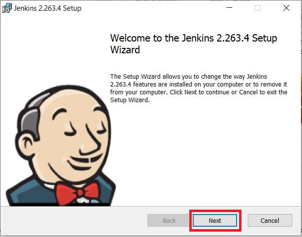

### Step 2: Select destination folder

Select the destination folder to store your Jenkins Installation and click Next to continue.

I choose: `C:\Softwares\Jenkins\`

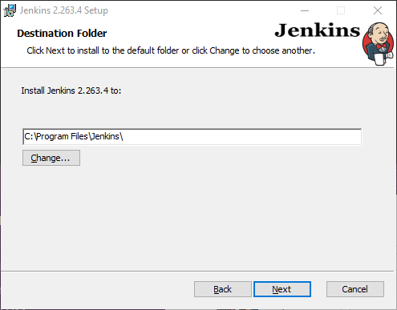

### Step 3: Service logon credentials

Open *Local Security Policy* -> *Security Setting* -> *Local Policies* -> *User Right Assignment*
-> **Log as a service**
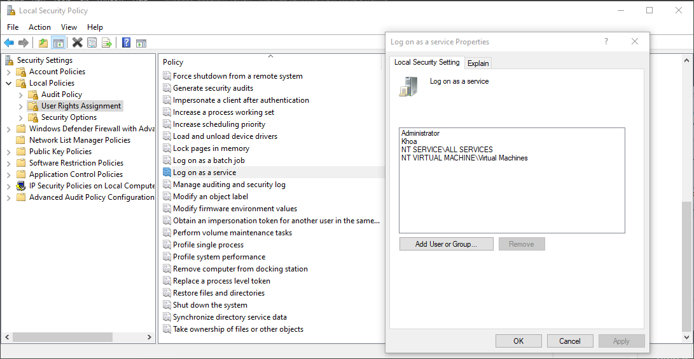

Click **Add User or Group...**
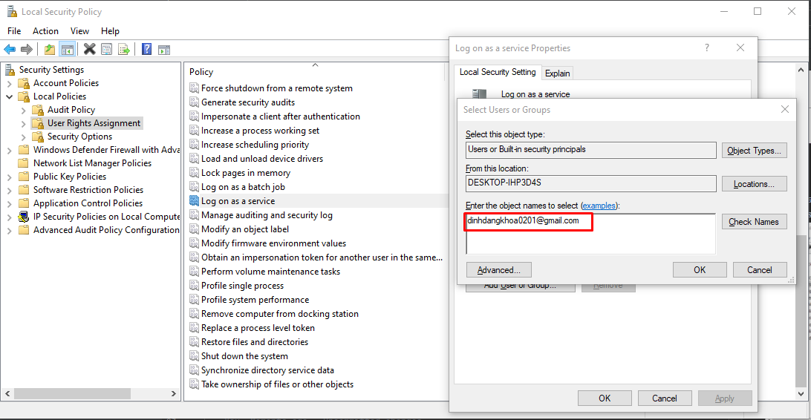

That username is the Microsoft account logged into your computer

Click **Check Names**

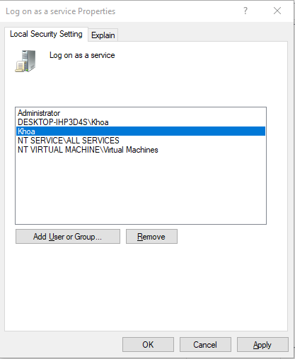

`Khoa` is the account logged into Jenkins as a service. Click Apply and Ok

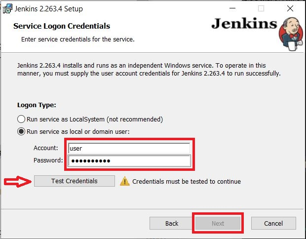

Type your Account and Password, click `Test Credentials` to test to continue

If it's OK, click `Next`

### Step 4: Port selection

Specify the port on which Jenkins will be running, Test Port button to validate whether the
specified port if free on your machine or not. Consequently, if the port is free, it will show a
green tick mark as shown below, then click on `Next`.

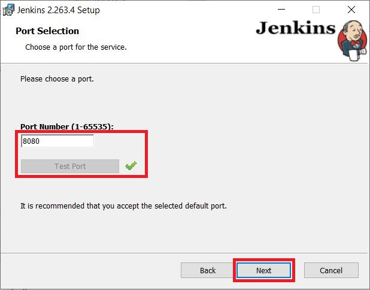

### Step 5: Select Java home directory

The installation process checks for Java on your machine and prefills the dialog with the Java home
directory. If the needed Java version is not installed on your machine, you will be prompted to
install it.

Once your Java home directory has been selected, click on `Next` to continue.

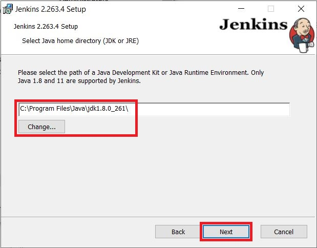

### Step 6: Custom setup

Select other services that need to be installed with Jenkins and click on `Next`.

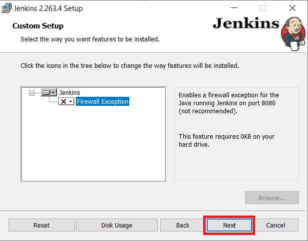

### Step 7: Install Jenkins

Click on the `Install` button to start the installation of Jenkins.

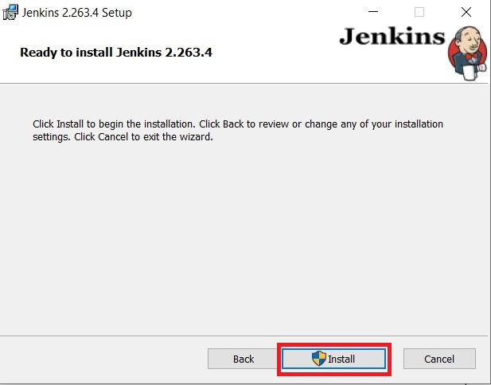

## Configuration Jenkins

Create `tmp` folder in Jenkins folder

Go to Jenkins folder, open file `jenkins.xml`

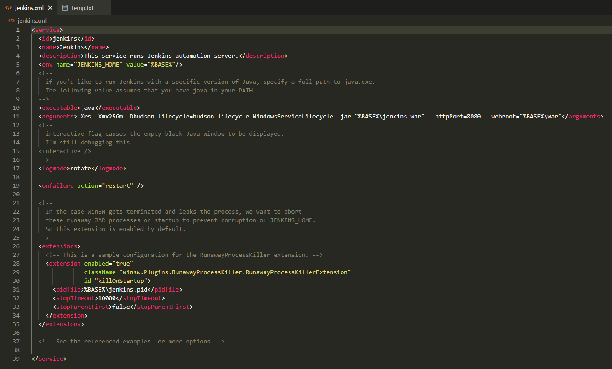

Change:

tag `<env>`, attribute `value`: C:\data\jenkins_home

tag `<arguments>`: -Xrs -Xms3g -Xmx3g -Djava.awt.headless=true -Djava.net.preferIPv4Stack=true
-Djava.io.tmpdir=C:\Softwares\Jenkins\tmp\
-Dorg.apache.commons.jelly.tags.fmt.timeZone=America/New_York -Duser.timezone=America/New_York
-Dhudson.lifecycle=hudson.lifecycle.WindowsServiceLifecycle -jar "C:\Softwares\Jenkins\Jenkins.war"
--httpPort=5000 --webroot="C:\Softwares\Jenkins\war" --pluginroot="C:\Softwares\Jenkins\plugins"

tag `<pidfile>`: C:\Softwares\Jenkins\jenkins.pid

#### Run Jenkins service

Go to `Services`

Right-click this record, click Start / Restart

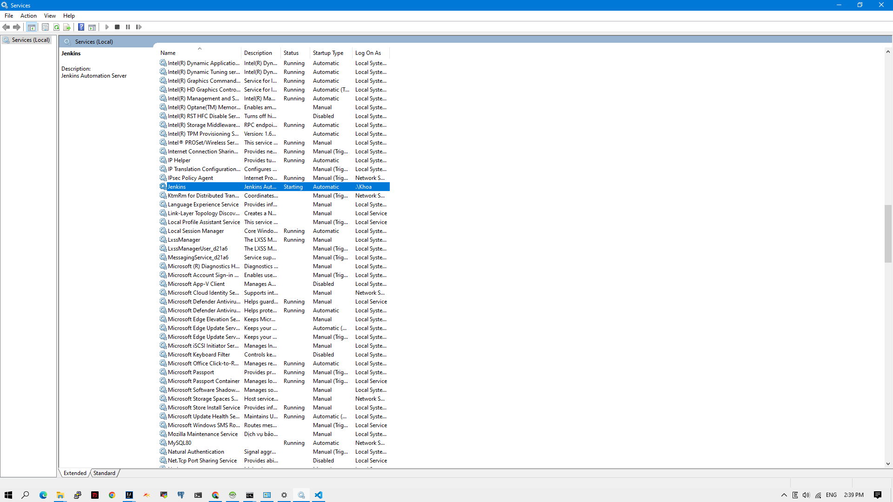

Open file `jenkins.err.log` to check the logs to see if jenkins started successfully or not

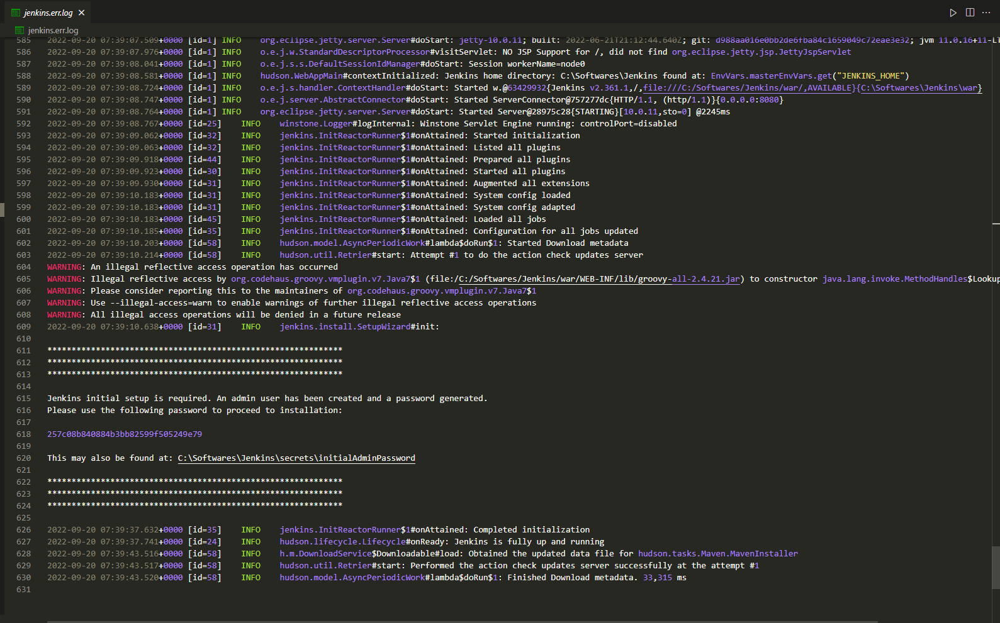
